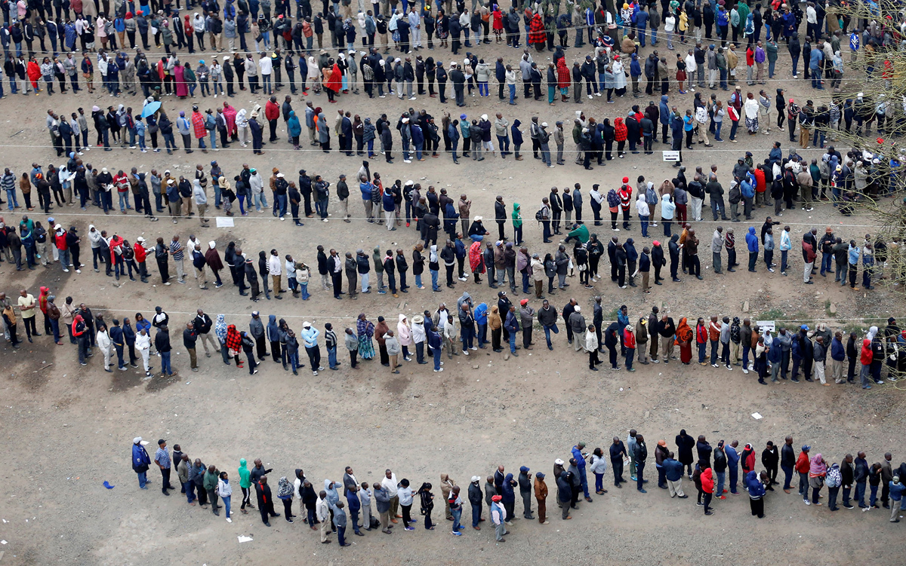

# Edition 008

## For release: August 12th

_This document is not finalized until the aforementioned date._

### Photo

https://www.theatlantic.com/photo/2017/08/photos-of-the-week-85811/536583/#img07

People wait outside a voting station in Nairobi, Kenya, on August 8th, 2017.

`Thomas Mukoya / Reuters`

### As You Already Know
Birth control is now [available](http://wate.com/2017/08/03/birth-control-available-without-doctor-visit-in-colorado/) without a doctor visit in Colorado. Walmart apologizes for [advertising](http://money.cnn.com/2017/08/09/news/companies/walmart-guns-back-to-school/index.html) guns as a "back-to-school" item. Trump declares a national emergency on [opioid abuse](http://www.reuters.com/article/us-usa-trump-opioid-idUSKBN1AQ2AW). As for nuclear weapons, it's no longer Kim Jong Un who is the biggest [madman](https://twitter.com/realDonaldTrump/status/895970429734711298) (Trump *continues* to escalate the situation). DaddyOFive has been [charged](https://www.fredericknewspost.com/news/crime_and_justice/courts/ijamsville-couple-behind-daddyofive-videos-charged-with-neglect/article_7ac9a5db-5545-5fd9-9329-79d343a330fe.html#tncms-source=article-nav-next) with neglect. It was discovered that the FBI [raided](http://www.news9.com/story/36097426/fbi-conducted-raid-of-paul-manaforts-home) Paul Manafort's home last month. Google [fires](https://www.bloomberg.com/news/articles/2017-08-08/google-fires-employee-behind-controversial-diversity-memo) the author of the controversial gender memo. A car hit a crowd of counter-protesters at a white nationalist's [rally](https://www.nytimes.com/2017/08/12/us/charlottesville-protest-white-nationalist.html?referer=https://t.co/8QFs6zs5Gs?amp=1) in Virginia. Finally, 'Barack Obama Day' is now a state holiday in Illinois.

### The Ideas

[Are There Black 'Queen Bees'?](https://www.theatlantic.com/business/archive/2017/08/black-queen-bees-women-khazan/536391/) // In the wake of the controversial Google memo, Valerie Greenaway further tackles this controversial issue in her thoughtful new *Atlantic* piece.

[The Battle for Venezuela And Its Oil](https://theintercept.com/2017/08/12/the-battle-for-venezuela-and-its-oil/) // Jeremy Scahill thoughtfully deconstructs the Venezuelan crisis with an eye towards the foreign powers that intervened in the nation's politics.

[What a Fraternity Hazing Death Revealed About the Painful Search for an Asian-American Identity](https://www.nytimes.com/2017/08/09/magazine/what-a-fraternity-hazing-death-revealed-about-the-painful-search-for-an-asian-american-identity.html?source=longreads&_r=0) // Fraternities have been associated with both camaraderie, identity, and trouble. What does one death reveal about the culture?

### The Leaks

[NEW VAULT 7 DISCLOSURE: COUCHPOTATO, A VIDEO STREAM EXPLOIT](https://wikileaks.org/vault7/#CouchPotato)
`WikiLeaks`

['EXTREME VETTING' PROPOSAL](https://theintercept.com/document/2017/08/07/hsi-extreme-vetting-industry-day-presentation/)
`The Intercept`

[JARED KUSHNER INTERN TALK](https://www.wired.com/story/jared-kushner-leak-full-audio/)
`WIRED`

### The Glitch
[Where a Cellular Apple Watch Would Be Great](https://techcrunch.com/2017/08/05/all-the-major-cases-where-an-lte-enabled-apple-watch-would-be-great/?ncid=mobilenavtrend) // The applications of smart watches are somewhat limited. But their cellular connectivity may change that.

[Google Announces Stamp to Stomp on Snap](https://www.digitaltrends.com/mobile/google-snapchat-discover-stamp/) // Google has announced it will launch a new Snapchat "competitor": Stamp. The catch: it replicates only one feature (and that's all it needs to).

[80 New Emojis](https://www.cnet.com/news/new-emoji-candidates-for-2018-unicode-11/) // 80 new emojis have been drafted as possible release candidates for Unicode 11.0.

### The Web

[Ten Years Ago](http://tenyearsago.io/) // See what the internet was doing ten years ago.

[The Public Domain Review](http://publicdomainreview.org/) // Analysis and reviews of publications recently released into the public domain.

[Images of Change](https://climate.nasa.gov/images-of-change?id=626#626-mount-pinatubo-philippines,-erupted-26-years-ago) // Look at the before-and-after shots of late 20th and early 21st century climate change. This politically-salient NASA project will leave you speechless.

### The Long Read
https://www.theatlantic.com/magazine/archive/2017/09/has-the-smartphone-destroyed-a-generation/534198/ Smartphones defined the iGeneration. But have they destroyed it?

### Actionable
https://www.givedirectly.org/ Give directly. It's the most efficient way to make an impact.
