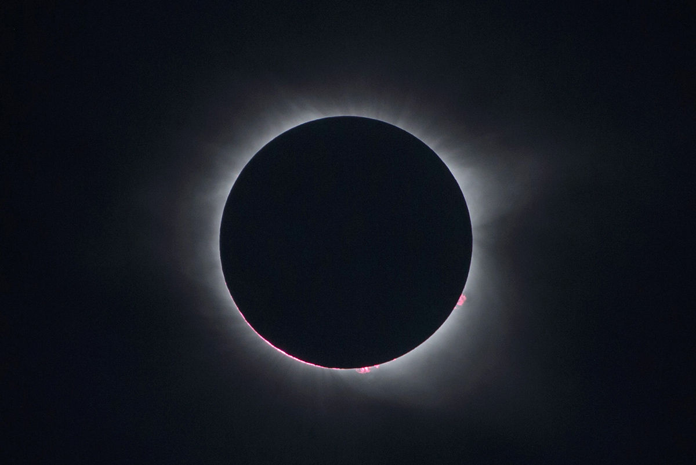

# Edition 010

## For release: August 26th

_This document is not finalized until the aforementioned date._

### Photo

https://www.theatlantic.com/photo/2017/08/photos-of-the-week-812818/537249/#img06

The August 21 total solar eclipse, as viewed from Charleston, South Carolina.

`Mandel Ngan / AFP / Getty`

### As You Already Know
The continental United States witnessed its first total solar [eclipse](http://www.telegraph.co.uk/news/2017/08/22/solar-eclipse-2017-best-images-video-funny-reaction-us-witnesses/) in 30 years. Trump [pardoned](https://apnews.com/fd2f3f72f49d45ae925f9f11d715a7c8/President-Trump-grants-pardon-to-former-Sheriff-Joe-Arpaio-of-Arizona) Joe Arpaio, the notorious Arizona sheriff who unfairly targeted Latinos in his policing in violation of a court order. Amazon has taken control of Whole Foods and plans to lower the grocery giant's [prices](http://money.cnn.com/2017/08/24/news/companies/amazon-whole-foods/index.html) on Monday. AccuWeather was discovered sending its user's [location data](http://www.zdnet.com/article/accuweather-caught-sending-geo-location-data-even-when-denied-access/) to its servers, even when the users had opted out. Poland Spring water isn't actually from a [spring](https://www.washingtonpost.com/news/business/wp/2017/08/22/not-one-drop-of-poland-spring-bottled-water-is-from-a-spring-lawsuit-claims/). A Florida death-row inmate was [executed](http://www.cnn.com/2017/08/24/health/florida-death-row-inmate-execution/index.html) using an experimental new drug cocktail. Charlottesville has covered its Confederate statues with [black tarps](http://www.chicagotribune.com/news/nationworld/ct-charlottesville-confederate-statue-black-shroud-20170823-story.html).

### The Ideas

[Congress keeps quiet on U.S. drone policy — and that’s a big problem](https://www.washingtonpost.com/news/monkey-cage/wp/2017/08/24/congress-keeps-quiet-on-u-s-drone-policy-and-thats-a-big-problem/) // Although drone strikes are rising under Trump, Congress has remained silent on the issue. In order to ensure accountability and prevent perpetual war, action must be taken soon.

[The Myth of the Kindly General Lee](https://www.theatlantic.com/politics/archive/2017/06/the-myth-of-the-kindly-general-lee/529038/) // Robert E. Lee was not a man worth celebrating. In fact, many of his most "respectable" virtues are pure fiction.

[Craigslist Posters Are Already Trying to Sell Their Used Eclipse Glasses as Collectors’ Items](http://www.slate.com/blogs/moneybox/2017/08/21/craigslist_posters_are_already_trying_to_sell_their_used_eclipse_glasses.html) // Monday's eclipse was an incredible experience, but the glasses used to view the spectacle are not worth more than the sum of their parts.

### The Leaks

[`GAME OF TRHONES`](https://www.vanityfair.com/hollywood/2017/08/game-of-thrones-leak-hbo-spain)

`HBO (via Vanity Fair)`

[`EXPRESSLANE: A CIA BIOTECH EXPLOIT PROGRAM`](https://wikileaks.org/vault7/#ExpressLane)

`WikiLeaks`

[`IPHONE 8: WIRELESS CHARGING`](http://bgr.com/2017/08/25/iphone-8-wireless-charging-feature-leak/)

`BGR`

### The Glitch
[Google Built a Fake City for Its Self-Driving Cars](http://www.slate.com/blogs/future_tense/2017/08/25/google_affiliated_waymo_built_a_fake_city_in_california_to_test_its_self.html) // Driverless cars aren't quite ready to be deployed to the streets of major cities. So Google did what any self-respecting major tech company would do: it built its own city.

[Google Releases Android 8: Oreo](https://www.android.com/versions/oreo-8-0/) // Android 8 promises to bring better performance, in-app password management, "picture-in-picture" mode, notification dots, and better security.

[Let Consumers Sue Companies](https://www.nytimes.com/2017/08/22/opinion/let-consumers-sue-companies.html) // Mandatory arbitration clauses prevent consumers from joining group lawsuits. This shouldn't be legal.

### The Web

[Windy](https://www.windy.com/?33.119,-78.926,5) // Watch where the wind blows.

[The Best Time to Visit Any City](https://championtraveler.com/travel-weather-map/) // This tool uses historical weather data to calculate the best time to visit any city.

[How Google Will Collapse](https://hackernoon.com/how-google-collapsed-b6ffa82198ee) // This thoughtful piece highlights the weaknesses in Google's business model, and the companies poised to take the search giant down.

### The Long Read
https://www.reuters.com/investigates/special-report/usa-taser-911/ "In the most detailed study ever of fatalities and litigation involving police use of stun guns, Reuters finds more than 150 autopsy reports citing Tasers as a cause or contributor to deaths across America. Behind the fatalities is a sobering reality: Many who die are among society’s vulnerable – unarmed, in psychological distress and seeking help."

### Actionable
https://wikimediafoundation.org/wiki/Ways_to_Give Donate to Wikipedia. Let the sum of human knowledge be free.
