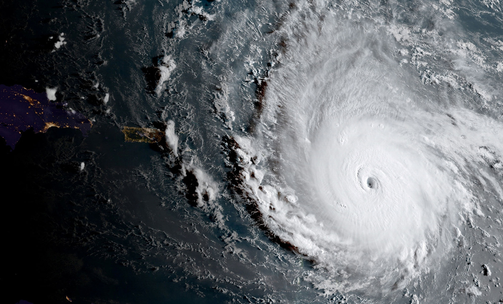

# Edition 012

## For release: September 9th

_This document is not finalized until the aforementioned date._

### Photo

https://www.theatlantic.com/photo/2017/09/photos-of-the-week-9298/539253/#img26

Hurricane Irma, a category 5 storm, as it approaches landfall in Southern Florida.
`NOAA / Reuters`

### As You Already Know
Equifax, one of the three major credit reporting bureaus, has [leaked](https://nyti.ms/2gQBeod) the personal details of nearly 200 million Americans. Hurricane Irma, a category 5 storm, is [approaching](http://www.cnn.com/2017/09/05/us/hurricane-irma-puerto-rico-florida/index.html) Florida—and FEMA is nearly [out of money](https://www.bloomberg.com/news/articles/2017-09-05/fema-is-almost-out-of-money-as-hurricane-irma-threatens-florida). [Free lunch](http://pix11.com/2017/09/06/free-lunch-now-will-be-provided-for-all-nyc-students/) will now be provided for all NYC public school students. North Korea's nuclear testing site is at risk of [collapsing](http://www.scmp.com/news/china/diplomacy-defence/article/2109725/north-koreas-nuclear-test-site-risk-imploding-chinese), a catastrophic event that would spread dangerous radiation throughout the region. Putin has [refused](https://www.nytimes.com/2017/09/06/world/asia/north-korea-putin-oil-embargo.html) to cut off North Korea's oil supply. A Canadian student [found](http://www.businessinsider.com/ancient-canadian-village-older-than-pyramids-2017-9) an ancient village 10,000 years older than the Pyramids. A magnitude 8 earthquake [hit](http://news.trust.org/item/20170908050116-wvzxh) in Southern Mexico.

### The Ideas

[What the Rich Won’t Tell You](https://www.nytimes.com/2017/09/08/opinion/sunday/what-the-rich-wont-tell-you.html?mcubz=0) // In America, wealth is taking on new connotations. Here is what the rich won't tell you.

[Season of Smoke](https://theintercept.com/2017/09/09/in-a-summer-of-wildfires-and-hurricanes-my-son-asks-why-is-everything-going-wrong/) // As wildfires rage in Canada and hurricanes ravage the American South, it begs the question: why is everything going wrong?

[The Uncomfortable Truth About Campus Rape Policy](https://www.theatlantic.com/education/archive/2017/09/the-uncomfortable-truth-about-campus-rape-policy/538974/) // Emily Yoffe voices her dissatisfaction with the current state policy surrounding sexual assault at college campuses around the country.

### The Leaks

[`PERSONAL (SSN, CC, ETC) DATA OF ~200 MILLION AMERICANS (via EQUIFAX)`](https://www.theverge.com/2017/9/8/16276584/equifax-breach-social-security-number-broken-system)

*`The Verge`*

[`NEW VAULT 7 DISCLOSURE: PROTEGO, A CIA MISSILE EXPLOIT`](https://wikileaks.org/vault7/#Protego)

*`WikiLeaks`*

### The Glitch
[Equifax Faces Multibillion-Dollar Lawsuit Over Hack](https://www.bloomberg.com/news/articles/2017-09-08/equifax-sued-over-massive-hack-in-multibillion-dollar-lawsuit) // Equifax's data breach is no joking matter. In fact, it may be the worst leak of personal info [ever](https://arstechnica.com/information-technology/2017/09/why-the-equifax-breach-is-very-possibly-the-worst-leak-of-personal-info-ever/).

[For the love of God, please tell me what your company does](https://hackernoon.com/for-the-love-of-god-please-tell-me-what-your-company-does-c2f0b835ab92) // Intangible business models have fallen out of style in Silicon Valley. Please, just tell us what your company *does*!

[Facebook Recruiters Are Stupid](http://imgur.com/hw2pnDt) // This leaked email chain reveals the Kafkaesque nature of recruting, even at one of the world's largest tech companies.

### The Web

[Helioviewer](https://www.helioviewer.org/) // Explore the sun across time!

[Space Dashboard](http://spacedashboard.com/) // A live feed from the ISS, scientific data from various satellites, and live trackers, all on one page.

[Google: Stop Being Evil](https://vivaldi.com/blog/google-return-to-not-being-evil/) // "A monopoly both in search and advertising, Google, unfortunately, shows that they are not able to resist the misuse of power."

### The Long Read
https://www.newyorker.com/magazine/2014/03/24/berlin-nights "The first person I met in Berlin was a boar-hunting friend of a friend, who agreed to talk to me only if I didn’t print his name. He was in his early forties, six and a half feet tall, muscular, lean, and fair, with shaggy reddish-brown hair, some stubble, and a great deal of self-confidence. He had on worn jeans, biker boots, a loose faded black T-shirt, and a scarf, and yet I’ll confess I found myself picturing him trim and tidy in Heidelberg duelling garb. Preconceptions can be hard to shake when you’re fresh in town."

### Actionable
https://www.redcross.org/donate/donation Donate to the Red Cross. Irma and Harvey have hit—and the Red Cross is there to help.
