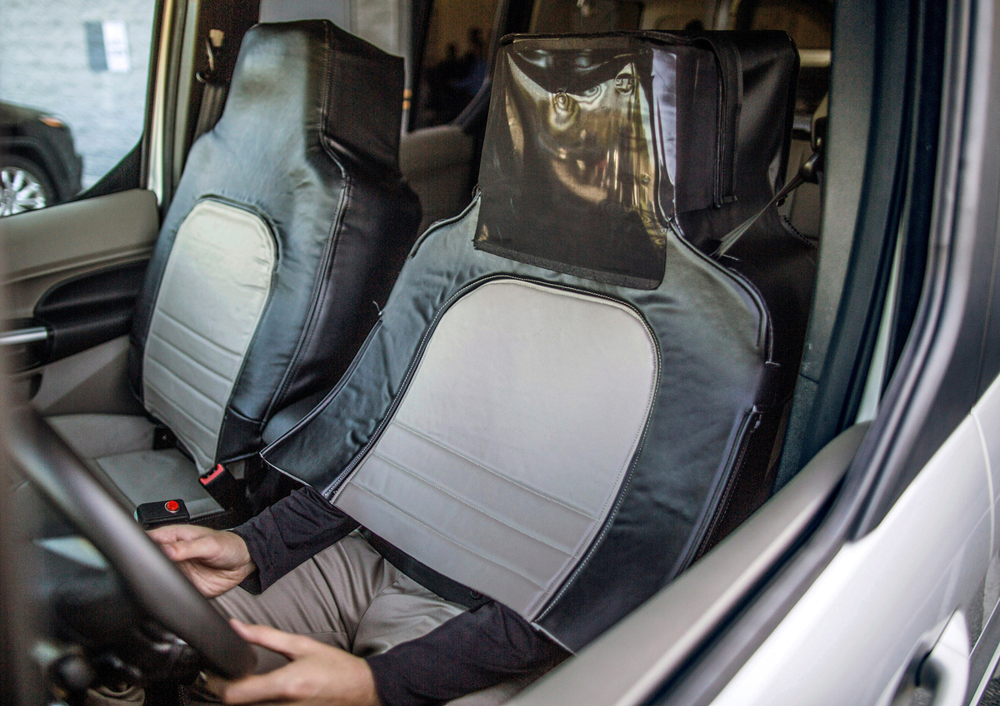

# Edition 013

## For release: September 17th

_This document is not finalized until the aforementioned date._

### Photo

https://www.theatlantic.com/photo/2017/09/photos-of-the-week-99915/540012/#img08

A Ford researcher dresses up as a car seat to test pedestrian responses to self driving cars.
`Ford Motor Company / Reuters`

### As You Already Know
After leaking the personal information of roughly 200 million Americans, Equifax is hit with a $70 billion [lawsuit](http://www.zerohedge.com/news/2017-09-08/equifax-hit-70-billion-lawsuit-after-leaking-143-million-social-security-numbers). North Korea has fired a [second](http://www.bbc.com/news/world-asia-41275614) ballistic missile over Japan. Protests erupt after a biracial UK boy was called racial slurs and nearly [hanged](http://news.sky.com/story/protest-after-biracial-boy-eight-nearly-hanged-by-teenagers-11033572). A security guard admits that he fabricated a story of a school shooting to cover up the fact that he accidentally shot [himself](http://www.startribune.com/classes-to-resume-at-st-kate-s-after-security-guard-shot/444161713/). Burger flipping has now been [automated](http://www.zmescience.com/science/news-science/burger-robot-flipping-meat-0432432/). Shoppers at Whole Foods have [increased](https://www.bloomberg.com/news/articles/2017-09-11/amazon-s-whole-foods-price-cuts-brought-25-jump-in-customers) by 25% after the grocery chain's acquisition by Amazon. The snow leopard is no longer [endangered](http://www.bbc.com/news/world-asia-41270646). After Trump refused to send condolences to Mexico after an earthquake and hurricane, Trump flip-flopped and instead blamed the [cell phone reception](https://twitter.com/realDonaldTrump/status/908409572943126528). Russia paid a UN expert [$50,000](https://www.unwatch.org/russia-gave-50000-un-expert-wrote-report-calling-russia-victim/) to write a report describing Russia as a victim.

### The Ideas

[Irma Won't "Wake Up" Climate Change-denying Republicans. Their Whole Ideology is on the Line.](https://theintercept.com/2017/09/11/irma-donald-trump-tax-cuts-climate-change-republican-ideology-capitalism/) // Republican climate change deniers don't doubt the science. They are instead afraid to admit that the free market needs regulation.

[Season of Smoke](https://theintercept.com/2017/09/09/in-a-summer-of-wildfires-and-hurricanes-my-son-asks-why-is-everything-going-wrong/) // As wildfires rage in Canada and hurricanes ravage the American South, it begs the question: why is everything going wrong?

[The Uncomfortable Truth About Campus Rape Policy](https://www.theatlantic.com/education/archive/2017/09/the-uncomfortable-truth-about-campus-rape-policy/538974/) // Emily Yoffe voices her dissatisfaction with the current state policy surrounding sexual assault at college campuses around the country.

### The Leaks

[`PERSONAL (SSN, CC, ETC) DATA OF ~200 MILLION AMERICANS (via EQUIFAX)`](https://www.theverge.com/2017/9/8/16276584/equifax-breach-social-security-number-broken-system)

*`The Verge`*

[`NEW VAULT 7 DISCLOSURE: PROTEGO, A CIA MISSILE EXPLOIT`](https://wikileaks.org/vault7/#Protego)

*`WikiLeaks`*

### The Glitch
[Equifax Faces Multibillion-Dollar Lawsuit Over Hack](https://www.bloomberg.com/news/articles/2017-09-08/equifax-sued-over-massive-hack-in-multibillion-dollar-lawsuit) // Equifax's data breach is no joking matter. In fact, it may be the worst leak of personal info [ever](https://arstechnica.com/information-technology/2017/09/why-the-equifax-breach-is-very-possibly-the-worst-leak-of-personal-info-ever/).

[For the love of God, please tell me what your company does](https://hackernoon.com/for-the-love-of-god-please-tell-me-what-your-company-does-c2f0b835ab92) // Intangible business models have fallen out of style in Silicon Valley. Please, just tell us what your company *does*!

[Facebook Recruiters Are Stupid](http://imgur.com/hw2pnDt) // This leaked email chain reveals the Kafkaesque nature of recruting, even at one of the world's largest tech companies.

### The Web

[Helioviewer](https://www.helioviewer.org/) // Explore the sun across time!

[Space Dashboard](http://spacedashboard.com/) // A live feed from the ISS, scientific data from various satellites, and live trackers, all on one page.

[Google: Stop Being Evil](https://vivaldi.com/blog/google-return-to-not-being-evil/) // "A monopoly both in search and advertising, Google, unfortunately, shows that they are not able to resist the misuse of power."

### The Long Read
https://www.newyorker.com/magazine/2014/03/24/berlin-nights "The first person I met in Berlin was a boar-hunting friend of a friend, who agreed to talk to me only if I didn’t print his name. He was in his early forties, six and a half feet tall, muscular, lean, and fair, with shaggy reddish-brown hair, some stubble, and a great deal of self-confidence. He had on worn jeans, biker boots, a loose faded black T-shirt, and a scarf, and yet I’ll confess I found myself picturing him trim and tidy in Heidelberg duelling garb. Preconceptions can be hard to shake when you’re fresh in town."

### Actionable
https://www.redcross.org/donate/donation Donate to the Red Cross. Irma and Harvey have hit—and the Red Cross is there to help.
