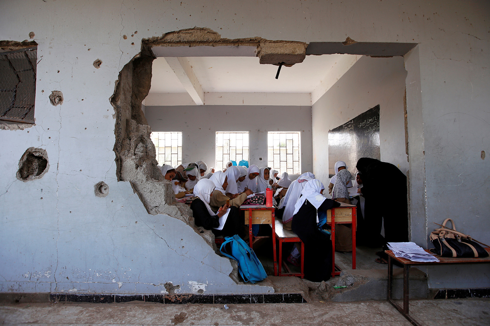

### Photo

Girls attend school in Hodeidah, Yemen, on October 24, 2017. Their school is damaged due to a recent Saudi-led airstrike.
`Abduljabbar Zeyad / Reuters`

### As You Already Know
The [first charges](http://myfox8.com/2017/10/27/first-charges-filed-in-mueller-investigation/) have been filed in the Mueller investigation. Catalonia has declared [independence](http://www.bbc.com/news/world-europe-41780116) from Spain. A Georgia election server was [wiped](https://apnews.com/877ee1015f1c43f1965f63538b035d3f/APNewsBreak:-Georgia-election-server-wiped-after-suit-filed) after a suit was filed challenging its security and integrity. The CIA plotted to stage [bombings](http://miami.cbslocal.com/2017/10/27/jfk-files-cia-plotted-kill-castro-stage-bombings-miami/) in Miami in the 1960's. Mueller is now investigating [Tony Podesta](https://www.nbcnews.com/news/us-news/mueller-now-investigating-democratic-lobbyist-tony-podesta-n812776). 38 women have come forward and [accused](http://www.latimes.com/entertainment/la-et-mn-james-toback-sexual-harassment-allegations-20171018-story.html) James Toback of sexual harassment. Tesla has restored [power](http://www.npr.org/sections/thetwo-way/2017/10/25/560045944/tesla-turns-power-back-on-at-childrens-hospital-in-puerto-rico) at a Puerto Rico children's hospital. Vaping will be [banned](http://www.bbc.co.uk/newsbeat/article/41734229/vaping-will-be-banned-in-indoor-public-places-in-the-state-of-new-york) in indoor public spaces in New York State.

### The Ideas

[When Rich Places Want to Secede](https://www.theatlantic.com/business/archive/2017/10/catalonia-secede-rich-region/544244/) // Catalonia is among the most wealthiest regions in Spain. Do they have an obligation to pay for the shortcomings of the rest of the nation?

[When It Comes to Surveillance, Watch the Watchmen](https://www.nytimes.com/2017/10/23/opinion/police-surveillance.html?_r=0) // Surveillance is increasingly being seen as a necessary evil in modern society. Can public oversight lessen its evils?

[Why We Must Fight for the Right to Repair Our Electronics](https://spectrum.ieee.org/green-tech/conservation/why-we-must-fight-for-the-right-to-repair-our-electronics) // Pending U.S. legislation could force manufacturers to make repair parts and information available at fair prices.

### The Leaks

[`MISCELLANEOUS PHONE LEAKS`](https://www.forbes.com/sites/ewanspence/2017/10/27/android-news-headlines-samsung-galaxyx-galaxys9-mate10-nokia2/#98dae017c1e8)

*`Ewan Spence, Forbes`*

(no other relevant leaks this week)

### The Glitch
[The New York Times is Now Available as a Tor Onion Service](https://open.nytimes.com/https-open-nytimes-com-the-new-york-times-as-a-tor-onion-service-e0d0b67b7482) // In an exciting move towards protecting its users' privacy, the New York Times now offers a Tor Hidden Service for its website: `nytimes3xbfgragh.onion`.

[Microsoft Has Stopped Manufacturing The Kinect](https://www.fastcodesign.com/90147868/exclusive-microsoft-has-stopped-manufacturing-the-kinect) // The once-groundbreaking device has fallen off the Microsoft production line. What does this mean for the future of XBox?

[Speech Recognition Is Not Solved](https://awni.github.io/speech-recognition/) // Digital assistants like Siri and Cortana have become excellent at speech recognition. That said, they still make *plenty* of errors.

### The Web

[Arxiv Vanity](https://www.arxiv-vanity.com/) // Tired of squinting at Arxiv papers? This site converts them into fully-responsive webpages.

[NDA Lynn](https://ndalynn.com/) // This artificial intelligence lawyer will advise you on whether or not you should sign that NDA.

[Curry Explorer](https://www.just-eat.co.uk/explore/curry/) // Unsure about what curry you should eat? This site will guide you—in two dimensions!

### The Long Read
https://www.buzzfeed.com/annehelenpetersen/wackadoodles-north-idaho?utm_term=.atwP6aJRr#.wvD7MopqD **Wackadoodles, Establishment Hacks, And The Big, Ugly, Local Battle For The Heart Of The GOP**: "The “whiteopia” of North Idaho has become one of the most desirable places in the West for conservatives to relocate. So why is the local Republican party tearing itself apart — and who’s responsible? "

### Actionable
https://www.redcross.org/donate/donation Donate to the Red Cross. Irma, Harvey, and Maria have hit—and the Red Cross is there to help.
