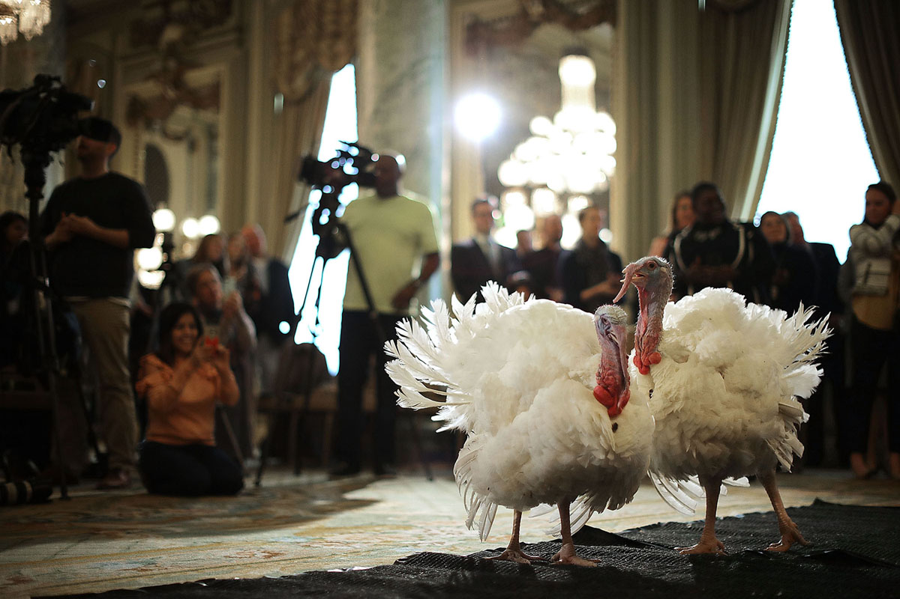

### Photo

Two turkeys are officially 'pardoned' in a traditional White House ceremony on November 20th, 2017.
`Chip Somodevilla / Getty`

### As You Already Know
A [terror attack](https://www.rte.ie/news/2017/1125/922731-egypt-strikes-against-militants-who-attacked-mosque/) at a mosque in Egypt left more than 300 worshippers dead.

The Federal Communications Commission announced plans to [repeal](https://motherboard.vice.com/en_us/article/9kqpav/fcc-ajit-pai-net-neutrality-thanksgiving-weekend) Net Neutrality. Canada is [concerned](https://motherboard.vice.com/en_us/article/ywb83y/justin-trudeau-is-very-concerned-with-fcc-plan-to-roll-back-net-neutrality-donald-trump), too. ([Here](https://worthhiding.com/2017/11/23/net-neutrality-is-important-heres-why-facts-statistics-rebuttals/) is the data on Net Neutrality, as well as [rebuttals](https://worthhiding.com/2017/11/26/counterarguments-to-common-anti-net-neutrality-ideas/) to common anti-Net Neutrality talking points.)

Robert Mugabe of Zimbabwe [resigned](http://www.bbc.com/news/world-africa-42071488?), ending his 37-year rule.

Indian PM Narendra Modi [said](http://indianexpress.com/article/india/right-for-all-to-access-the-internet-is-non-negotiable-says-ravi-shankar-prasad-at-cyberspace-meet-4951105/) that Internet access is a right.

Pope Francis [denounced](https://www.cbsnews.com/news/pope-francis-denounces-climate-change-deniers/) climate change deniers.

Donald Trump [appeared](http://www.nydailynews.com/news/politics/trump-appears-panama-papers-time-article-1.3655007) in the Panama Papers for the first time.

A [mysterious object](https://www.theguardian.com/science/across-the-universe/2017/nov/20/interstellar-object-confirmed-to-be-from-another-solar-system) has been confirmed to be from another solar system. (Don't get excited, it's not aliens.)

Trump [said](https://www.washingtonpost.com/news/post-politics/wp/2017/11/19/trump-calls-elephant-hunting-a-horror-show-and-suggests-hell-enforce-a-ban-on-trophy-imports/) that he will enforce a ban on trophy imports in hunting.

Victims of child abuse in the Jehovah's Witness faith were [told](http://www.bbc.com/news/uk-england-42025255) repeatedly not to report their experiences by the church.

*(See also: [Uber hack](https://www.bloomberg.com/news/articles/2017-11-21/uber-concealed-cyberattack-that-exposed-57-million-people-s-data) in 'The Glitch' section below.)*

### The Ideas

[A Voice of Hate in America’s Heartland](https://www.nytimes.com/2017/11/25/us/ohio-hovater-white-nationalist.html?_r=0) // Tony Hovater, a 29-year-old welder, helped form a pro-Nazi group. Now he is hoping his bigotry and fascist ideals will go mainstream. *See also: [Nazis Are Just Like You and Me, Except They're Nazis](https://www.theatlantic.com/technology/archive/2017/11/a-nazi-cooks-pasta/546737/)*

[Former Thinx Employee Accuses Miki Agrawal of Sexual Harassment](https://www.thecut.com/2017/03/thinx-employee-accuses-miki-agrawal-of-sexual-harassment.html) // The self-styled “She-E.O.” prided herself on breaking taboos. According to some employees, she went too far.

[Tim Berners-Lee on the future of the web: 'The system is failing'](https://www.theguardian.com/technology/2017/nov/15/tim-berners-lee-world-wide-web-net-neutrality) // The inventor of the world wide web remains an optimist but sees a ‘nasty wind’ blowing amid concerns over advertising, net neutrality and fake news.

### The Leaks

[`THE PARADISE PAPERS: DONALD TRUMP`](http://www.nydailynews.com/news/politics/trump-appears-panama-papers-time-article-1.3655007)

*`New York Daily News`*

### The Glitch
[Uber Paid Hackers to Delete Stolen Data on 57 Million People](https://www.bloomberg.com/news/articles/2017-11-21/uber-concealed-cyberattack-that-exposed-57-million-people-s-data) // Hackers stole the personal data of 57 million customers and drivers from Uber Technologies Inc., a massive breach that the company concealed for more than a year.

[Modern Media Is a DoS Attack on Your Free Will](http://nautil.us/issue/52/the-hive/modern-media-is-a-dos-attack-on-your-free-will) // How the attention economy is subverting our decision-making and our democracy.

[Google collects Android users’ locations even when location services are disabled](https://qz.com/1131515/google-collects-android-users-locations-even-when-location-services-are-disabled/) // Android phones are tracking your location even if you actively turn off location services, haven't used any apps, and haven't even inserted a carrier SIM card.

### The Web

[MusicMap](https://musicmap.info/) // The genealogy of music genres, with history, descriptions and sample playlists.

### The Long Read
https://www.nytimes.com/interactive/2017/11/16/magazine/uncounted-civilian-casualties-iraq-airstrikes.html?_r=1 **Uncounted**: An on-the-ground investigation reveals that the U.S.-led battle against ISIS — hailed as the most precise air campaign in history — is killing far more Iraqi civilians than the coalition has acknowledged.

### Actionable
https://www.battleforthenet.com/ Net Neutrality is under attack (again). Help save the Internet.
