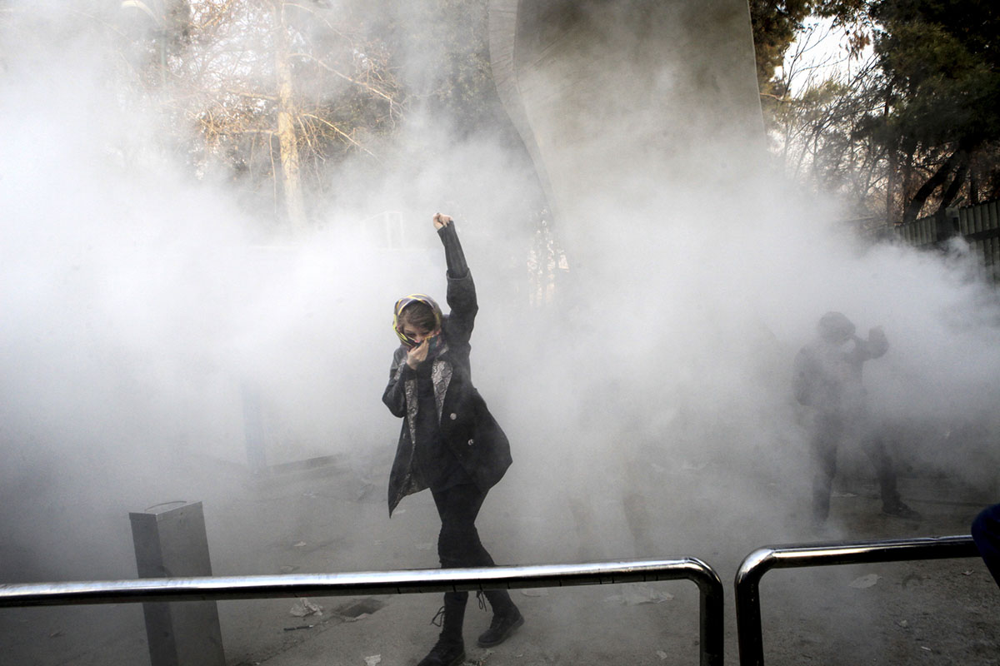

### Photo

A university student in Tehran participates in a protest against Iran's president.

`AP`

### As You Already Know
North and South Korea began [talks](https://edition.cnn.com/2018/01/04/asia/north-korea-south-korea-talks-intl/index.html). They seem to be going [well](https://www.cnn.com/2017/12/31/asia/kim-jong-un-new-year-address-nuclear/index.html).

Donald Trump [called](https://www.rt.com/usa/414864-trump-nuclear-button-north-korea/) his nuclear button bigger than Kim Jong Un's.

Google's Project Zero [revealed](https://googleprojectzero.blogspot.com/2018/01/reading-privileged-memory-with-side.html) two major security vulnerabilities that affect nearly all computers and phones.

2017 was the [safest](https://in.reuters.com/article/aviation-safety/2017-safest-year-on-record-for-commercial-passenger-air-travel-groups-idINKBN1EQ17J) year for passenger air travel.

Iranian forces [fired](http://www.telegraph.co.uk/news/2017/12/30/iranian-students-clash-police-tehran-protests-enter-third-day/) on protesters.

The ozone is slowly [returning](https://arstechnica.com/science/2018/01/new-measurement-confirms-the-ozone-is-coming-back/).

China took further steps to improve its environmental footprint by [banning](https://www.autoblog.com/2017/12/29/china-smog-553-cars-banned/) 553 exhaust-heavy car models.

Facebook [explained](https://www.theguardian.com/us-news/2018/jan/04/facebook-chechnya-ramzan-kadyrov-political-censorship) why it deleted some accounts, but refused to explain why it deleted others.

Donald Trump and Rand Paul are pushing to [end](https://timesofindia.indiatimes.com/world/us/good-idea-trump-responds-to-senator-rand-pauls-proposal-to-stop-all-aid-to-pakistan/articleshow/62392171.cms) all aid to Pakistan.

Russia [said](http://www.newsweek.com/russia-tells-us-back-iran-and-focus-ferguson-riots-and-occupy-wall-street-768949) that the United States can't criticize Iran over its response to protests because it crushed the Occupy Wall Street and Ferguson protests.

A new book on the first year of the Trump presidency [calls](https://www.theguardian.com/us-news/2018/jan/03/donald-trump-russia-steve-bannon-michael-wolff) Trump's actions 'treasonous.'

France's president Emmanuelle Macron [announced](http://www.bbc.com/news/world-europe-42560688) a new 'fake news' law.

Jeff Sessions made a [move](http://time.com/5088442/jeff-sessions-marijuana-legal/) to jeopardize the legal marijuana industry.

### The Ideas

[Donald Trump Goes Full Fredo](https://www.theatlantic.com/politics/archive/2018/01/donald-trump-goes-full-fredo/549875/) // But unlike the Godfather character, the president of the United States is backed by powerful people enabling him.

[A President Who Attempts to Ban Books That Expose Him Should Be Impeached](https://www.thenation.com/article/a-president-who-attempts-to-ban-books-that-expose-him-should-be-impeached/) // Trump’s legal threats represent an assault not just on Michael Wolff’s book but on the basic premise of the US Constitution.

[Enough About Steve Bannon. Rupert Murdoch’s Influence on Donald Trump Is More Dangerous.](https://theintercept.com/2018/01/06/rupert-murdoch-trump-fire-and-fury-steve-bannon/) // Michael Wolff's new book shows how Murdoch, the founder of Fox News, is a close adviser to Trump. This is a problem.

### The Leaks

[`NSA MEMO LEAKS`](http://nymag.com/daily/intelligencer/2018/01/nsa-chief-mike-rogerss-classified-retirement-memo-leaks.html)

*`New York Magazine`*

[`STEVE BANNON LEAKS`](http://thehill.com/homenews/media/367482-limbaugh-most-leaks-coming-from-white-house-were-from-bannon)

*`The Hill`*

[`AN ENTIRE BOOK ON TRUMP`](https://en.wikipedia.org/wiki/Fire_and_Fury)

*`Michael Wolff`*

### The Glitch
[Why Raspberry Pi isn't vulnerable to Spectre or Meltdown](https://www.raspberrypi.org/blog/why-raspberry-pi-isnt-vulnerable-to-spectre-or-meltdown/) // Eben gives you a crash course in how modern processors work to explain why Raspberry Pi is unaffected by the Spectre and Meltdown security vulnerabilities.

[NSA’s top talent is leaving because of low pay, slumping morale and unpopular reorganization](https://www.washingtonpost.com/world/national-security/the-nsas-top-talent-is-leaving-because-of-low-pay-and-battered-morale/2018/01/02/ff19f0c6-ec04-11e7-9f92-10a2203f6c8d_story.html) // Since 2015, the spy service has lost several hundred hackers, engineers and data scientists.

[The T2 chip makes the iMac Pro the start of a Mac revolution](https://www.macworld.com/article/3245764/macs/the-t2-chip-makes-the-imac-pro-the-start-of-a-mac-revolution.html) // Sure, it's the fastest Mac ever made, but the T2 chip is what really makes it different.

### The Web

[Make My Drive Fun](https://makemydrive.fun/) // Find all the quirky places along your road trip.

### The Long Read
https://theintercept.com/2018/01/03/my-life-as-a-new-york-times-reporter-in-the-shadow-of-the-war-on-terror/ **The Biggest Secret: My Life as a New York Times Reporter in the Shadow of the War on Terror**: "As I took the stand, I thought about how much press freedom had been lost and how drastically national security reporting had changed in the post-9/11 era."

### Actionable
https://www.battleforthenet.com/ Net Neutrality died. But we can bring it back. Help save the Internet.
