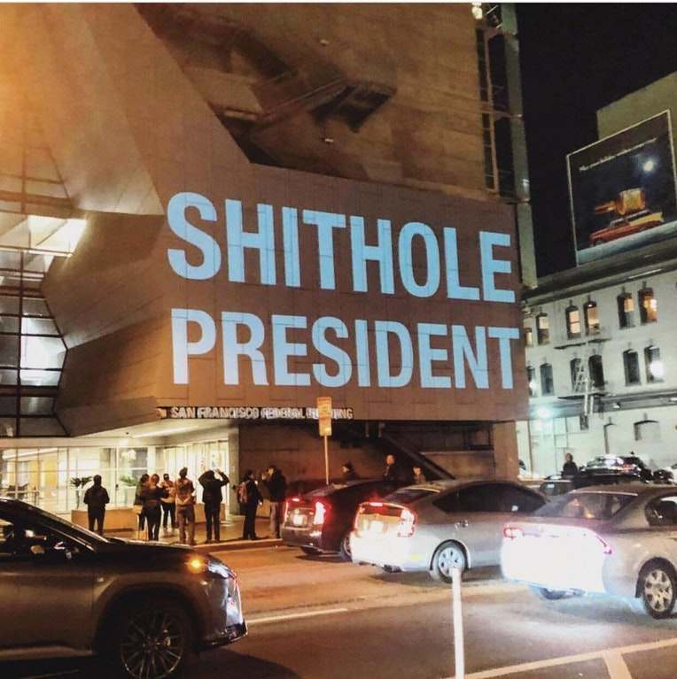

### Photo

A projection on the San Francisco Federal Building following Donald Trump's remarks calling impoverished nations "shithole countries."

`denolly on Reddit`

### As You Already Know
Amid protests, Iran’s government [censored](https://theintercept.com/2018/01/13/iran-protests-internet-censorship/) its critics with Chinese-style Internet control.

The United States ambassador to Panama [resigned](https://www.independent.co.uk/news/world/americas/us-ambassador-panama-resigns-donald-trump-john-feeley-not-work-president-a8156116.html), saying that he can "no longer work for Trump."

Jared Kusher [received](https://www.commondreams.org/news/2018/01/08/kushner-under-fire-receiving-30m-israeli-firm-while-shaping-middle-east-policy) $30 million dollars from an Israeli firm while shaping US Middle East policy.

Belize [ended](https://www.ecowatch.com/belize-offshore-drilling-wwf-2522728566.html) its ocean oil operations.

Trump [derided](https://www.washingtonpost.com/politics/trump-attacks-protections-for-immigrants-from-shithole-countries-in-oval-office-meeting/2018/01/11/bfc0725c-f711-11e7-91af-31ac729add94_story.html) immigration from 'shithole' countries.

The Trump Administration [waived](http://www.ibtimes.com/political-capital/trump-administration-waives-punishment-convicted-banks-including-deutsche-which) the punishment for several convicted banks, including Deutsche — a bank that Trump owes millions.

North Korea will [participate](https://www.ctvnews.ca/world/north-korea-taking-part-in-south-korean-olympics-after-talks-1.3751239) in the South Korean 2018 Winter Olympics.

Trump [cancelled](https://www.independent.co.uk/news/world/americas/us-politics/trump-trip-visit-cancelled-uk-britain-embassy-opening-latest-news-updates-a8154716.html) his trip to London, and blamed Obama for it.

The United Kingdom began [enforcing](https://www.theguardian.com/environment/2018/jan/09/plastic-microbeads-ban-enters-force-in-uk) a ban on plastic microbeads in cosmetics.

Austria’s president [intervened](http://www.telegraph.co.uk/news/2018/01/07/president-steps-islamophobic-abuse-austrias-new-year-baby/) after the first child to be born in the country in 2018 was subjected to racist online abuse for having a Muslim family.

A suicide at a Chinese iPhone factory [reignited](http://www.telegraph.co.uk/news/2018/01/07/suicide-chinese-iphone-factory-reignites-concern-working-conditions/) concerns over working conditions.

### The Ideas

[“We Don’t Consider You a Legitimate Journalist” — How I Got Blacklisted by the Pentagon’s Africa Command](https://theintercept.com/2018/01/13/we-dont-consider-you-a-legitimate-journalist-how-i-got-blacklisted-by-the-pentagons-africa-command/) // Nick Turse has reported extensively on secretive U.S. military operations—which is apparently why Africa Command has tried to freeze him out.

[The remarkable Republican underreaction on 'shithole'](http://www.cnn.com/2018/01/12/politics/shithole-comment-republican-reaction/index.html) // On Thursday afternoon, in a meeting on a potential deal on immigration, President Donald Trump disparaged immigrants from a numbers of countries including African nations and El Salvador.

[Dear Donald Trump, we maybe from shit-holes, but we are not assholes](http://www.nigeriatoday.ng/2018/01/dear-donald-trump-we-maybe-from-shit-holes-but-we-are-not-assholes/) // _Nigeria Today_'s open letter to Donald Trump.

### The Leaks

[`LIONEL MESSI'S 100M CONTRACT`](http://www.spiegel.de/international/world/football-leaks-lionel-messi-s-100-million-euro-contract-a-1187549.html)

*`Spiegel`*

[`KASPERSKY RUSSIA HACK`](https://finance.yahoo.com/news/experts-link-nsa-leaks-shadow-brokers-russia-kaspersky-144840962.html)

*`The Hill`*

_See also: [In Praise of Leaks (Time Magazine)](http://time.com/5098422/in-praise-of-leaks/)_

### The Glitch
[A letter about Google AMP](http://ampletter.org/) // An open letter about Google AMP.

[Signal partners with Microsoft to bring end-to-end encryption to Skype](https://signal.org/blog/skype-partnership/) // Signal, the encrypted messaging app, details its new partnership with Microsoft.

[Your smartphone📱is making you👈 stupid, antisocial 🙅 and unhealthy 😷. So why can't you put it down❔⁉️](https://www.theglobeandmail.com/technology/your-smartphone-is-making-you-stupid/article37511900/) // A decade ago, smart devices promised to change the way we think and interact, and they have – but not by making us smarter. Eric Andrew-Gee explores the growing body of scientific evidence that digital distraction is damaging our minds

### The Web

[Meltdown Demonstration](https://github.com/IAIK/meltdown/) // A working demonstration of the Meltdown hack.

### The Long Read
https://www.nytimes.com/2018/01/10/movies/tonya-harding-i-tonya-nancy-kerrigan-scandal.html **Tonya Harding Would Like Her Apology Now**: "In the movie, “I, Tonya,” the disgraced figure skater looks back on the 1994 Nancy Kerrigan scandal and her struggles to tell her side of the story."

### Actionable
https://www.battleforthenet.com/ Net Neutrality died. But we can bring it back. Help save the Internet.
