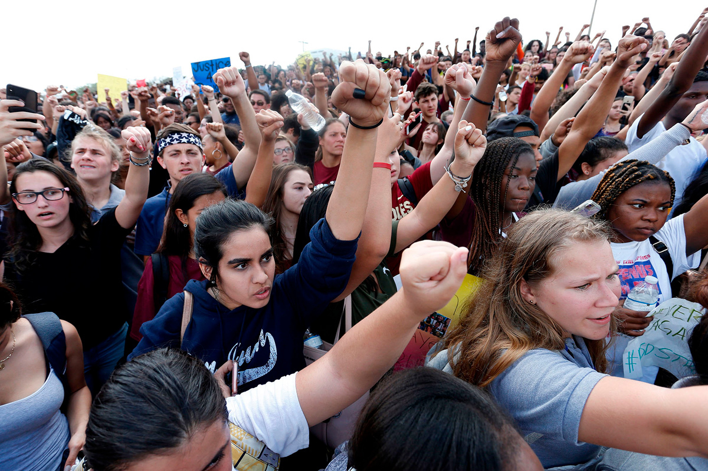

### Photo

Students from nearby high schools rally at Marjory Stoneman Douglas High School after participating in a county-wide school walk out in Parkland, Florida on February 21, 2018. (via the Atlantic)

`Rhona Wise / AFP / Getty`

### As You Already Know
Nearly 400kg of cocaine was [found](https://www.thejournal.ie/argentina-cocaine-3867152-Feb2018/) inside the Russian embassy in Buenos Aires.

Top U.S. officials [told](https://www.washingtonpost.com/world/top-us-officials-tell-the-world-to-ignore-trumps-tweets/2018/02/18/bc605236-14a2-11e8-942d-16a950029788_story.html?utm_term=.e68e07aad6d4) the world to ignore Trump’s tweets.

Former Trump campaign official Rick Gates [pleaded](https://www.cnbc.com/2018/02/23/former-trump-campaign-official-rick-gates-pleads-guilty-on-two-counts.html) guilty to lying and conspiracy against the United States.

Anti-gay 'vote Putin' video went [viral](http://www.france24.com/en/20180219-anti-gay-vote-putin-video-goes-viral-russia) in Russia.

The German government [confirmed](http://www.dw.com/en/germany-confirms-2017-surplus-and-gdp-growth/a-42706491) that in 2017 it had both a budget surplus and strong GDP growth.

Taiwan will [ban](https://www.hongkongfp.com/2018/02/22/taiwan-ban-single-use-plastic-drinking-straws-plastic-bags-disposable-utensils-entirely-2030/) single-use plastic drinking straws, plastic bags, and disposable utensils entirely by 2030.

Sixty-six people are feared to have been killed in a [passenger plane crash](http://www.bbc.com/news/world-middle-east-43103192) in the Zagros mountains in Iran.

UK millennials [suffered](https://www.independent.co.uk/news/business/news/uk-millennials-income-fall-worst-nationality-greece-earnings-report-resolution-foundation-a8217676.html) the worst falls in earnings of any advanced economy apart from Greece, a new report reveals.

We’re [witnessing](https://www.vox.com/energy-and-environment/2017/12/12/16767152/arctic-sea-ice-extent-chart) the fastest decline in Arctic sea ice in at least 1,500 years.

Russian opposition leader Alexei Navalny was [detained](https://www.theguardian.com/world/2018/feb/22/alexei-navalny-detained-moscow-russian-opposition-leader-faces-jail-election) in Moscow.

Signal, the "gold standard" encrypted messenger, [received](https://signal.org/blog/signal-foundation/) $50 million in funding from WhatsApp co-founder Brian Acton to start the "Signal Foundation."

### The Ideas

[CNN’s town hall on guns and the unmaking of Marco Rubio](https://www.newyorker.com/news/news-desk/cnns-town-hall-on-guns-and-the-unmaking-of-marco-rubio) // The voices of parents and students from Marjory Stoneman Douglas High School could be an inflection point in America’s broken politics surrounding guns.

[Dread accompanies me through life but it is not without consolation](https://aeon.co/essays/dread-accompanies-me-through-life-but-it-is-not-without-consolation) // Samir Chopra: My anxiety has been lifelong but I would not wish it away. It has made me the philosopher – and person – that I am today.

[China's Xinjiang surveillance is the dystopian future nobody wants](https://www.engadget.com/2018/02/22/china-xinjiang-surveillance-tech-spread/) // Monitoring tech pioneered in the region is spreading across China and the world.

[It is not going well](https://www.economist.com/news/leaders/21737029-israel-and-iran-clash-syria-russia-finds-itself-increasingly-bind-its-own) // As Israel and Iran clash in Syria, Russia finds itself increasingly in a bind of its own making.

### The Leaks

_No relevant leaks this week._

### The Glitch
[Mozilla v FCC: Mozilla Re-files Suit Against FCC to Protect Net Neutrality](https://blog.mozilla.org/blog/2018/02/22/mozilla-v-fcc-mozilla-re-files-suit-fcc-protect-net-neutrality/) //
Two days ago, the Federal Communications Commission officially published its order overturning net neutrality rules in the Federal Register. Mozilla refiled suit.

[Node Package Manager: Critical Linux filesystem permissions are being changed by latest version (#19883)](https://github.com/npm/npm/issues/19883) // "By running `sudo npm` under a non-root user (root users do not have the same effect), filesystem permissions are being heavily modified."

[Electron 2.0 Announced](https://electronjs.org/releases#2.0.0-beta.1) // Electron, the popular desktop app framework, has announced version `2.0`.

### The Web

[Omnicalculator](https://www.omnicalculator.com/) // This website has 376 different kinds of calculators. They cover business, fitness, and even physics.

### The Long Read
https://www.nytimes.com/2018/02/20/magazine/the-case-against-google.html **The Case Against Google**: Critics say the search giant is squelching competition before it begins. Should the government step in?

### Actionable
https://www.battleforthenet.com/ Net Neutrality died. But we can bring it back. Help save the Internet.
