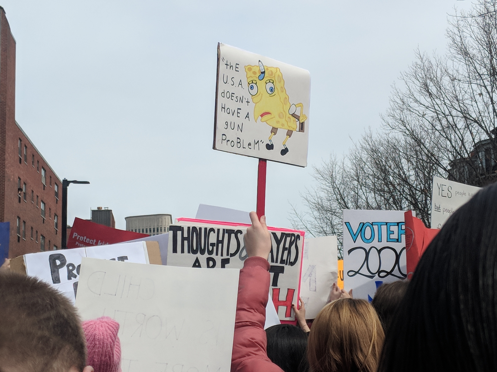

### Photo

A protester holds up a sign saying sarcastically that "the U.S. doesn't have a gun problem" during the March for our Lives in Boston, MA.

`Miles McCain / OPENWIRE`

### As You Already Know
Saudi Crown Prince Mohammed bin Salman [boasted](https://theintercept.com/2018/03/21/jared-kushner-saudi-crown-prince-mohammed-bin-salman/) that Jared Kushner was “in his pocket.”

Vladimir Putin [won reelection](https://apnews.com/tag/RussiaElection). No one is [surprised](http://www.bbc.com/news/world-europe-43452449?__twitter_impression=true).

DNC hacker "Guccifer 2.0" [slipped up](https://www.thedailybeast.com/exclusive-lone-dnc-hacker-guccifer-20-slipped-up-and-revealed-he-was-a-russian-intelligence-officer) and revealed he was a Russian intelligence officer.

The UK Parliament summoned Mark Zuckerberg to testify following the [Cambridge Analytica scandal](http://www.bbc.com/news/uk-43474760).

Cambridge Analytica's offices were [raided](http://www.bbc.com/news/uk-43522775) by British ICO police.

'Utterly horrifying': an ex-Facebook insider [says](https://www.theguardian.com/news/2018/mar/20/facebook-data-cambridge-analytica-sandy-parakilas?CMP=Share_iOSApp_Other) covert data harvesting was routine.

(More on the Cambridge Analytica scandal is available [here](https://www.theguardian.com/news/series/cambridge-analytica-files).)

A [hostage situation](http://www.bbc.com/news/world-europe-43512791) unfolded in Trèbes, France. ISIS claimed responsibility.

Trump’s national security advisers warned him not to congratulate Putin. [He did it anyway.](https://www.washingtonpost.com/politics/trumps-national-security-advisers-warned-him-not-to-congratulate-putin-he-did-it-anyway/2018/03/20/22738ebc-2c68-11e8-8ad6-fbc50284fce8_story.html?utm_term=.f0f095adca08)

Trump’s election consultants were [filmed](https://www.channel4.com/news/cambridge-analytica-revealed-trumps-election-consultants-filmed-saying-they-use-bribes-and-sex-workers-to-entrap-politicians-investigation) saying they use bribes and sex workers to entrap politicians.

### The Ideas

[Facebook’s Surveillance Machine](https://www.nytimes.com/2018/03/19/opinion/facebook-cambridge-analytica.html) // It’s true that the Cambridge Analytica incident wasn’t a security breach. It was something far worse.

[Facebook is a surveillance company rebranded as 'social media'](https://www.washingtonexaminer.com/news/edward-snowden-facebook-is-a-surveillance-company-rebranded-as-social-media) // "Businesses that make money by collecting and selling detailed records of private lives were once plainly described as 'surveillance companies,'" Snowden said. "Their rebranding as 'social media' is the most successful deception since the Department of War became the Department of Defense."

[Trump is Afraid of Putin](http://www.newsweek.com/former-cia-director-trump-afraid-putin-congratulations-phone-call-854976) // The Russians might just have something on Trump, warned former CIA Director John Brennan. _(Note: John Brennan is infamous for his use of drones and reckless assassinations of civilians. He is no champion of civil liberties.)_

### The Leaks

[`CAMBRIDGE ANALYTICA CORRESPONDENCE`](http://www.businessinsider.com/emails-facebook-cambridge-analytica-response-data-scandal-2018-3)

`Business Insider`

### The Glitch
[Self-driving Uber car kills Arizona woman crossing street](https://www.reuters.com/article/us-autos-selfdriving-uber/self-driving-uber-car-kills-arizona-woman-crossing-street-idUSKBN1GV296) // An Uber self-driving car hit and killed a woman crossing the street in Arizona, police said on Monday, marking the first fatality involving an autonomous vehicle and a potential blow to the technology expected to transform transportation.

[Elon Musk deletes own, SpaceX and Tesla Facebook pages after #deletefacebook](https://techcrunch.com/2018/03/23/elon-musk-deletes-own-spacex-and-tesla-facebook-pages-after-deletefacebook/) // Elon Musk apparently wasn’t aware that his company SpaceX had a Facebook page. When it was brought to his attention, he deleted it.

[How Congress Censored the Internet](https://opkode.com/blog/slacks-bait-and-switch/) // In passing SESTA/FOSTA, lawmakers failed to separate their good intentions from bad law.

### The Web

[What every browser knows about you](http://webkay.robinlinus.com/) // Figure out what data your web browser reveals to every site you visit.

[Muscle Wiki](https://musclewiki.org/) // Learn about human muscular structure on this interactive site.

### The Long Read
https://www.channel4.com/news/exposed-undercover-secrets-of-donald-trump-data-firm-cambridge-analytica **Exposed: Undercover secrets of Trump’s data firm**: An investigation by Channel 4 News has revealed how Cambridge Analytica claims it ran ‘all’ of President Trump’s digital campaign – and may have broken election law. As the report went on air, the firm announced it has suspended chief executive Alexander Nix, pending a full investigation.

### Actionable
https://www.battleforthenet.com/ Net Neutrality died. But we can bring it back. Help save the Internet.
