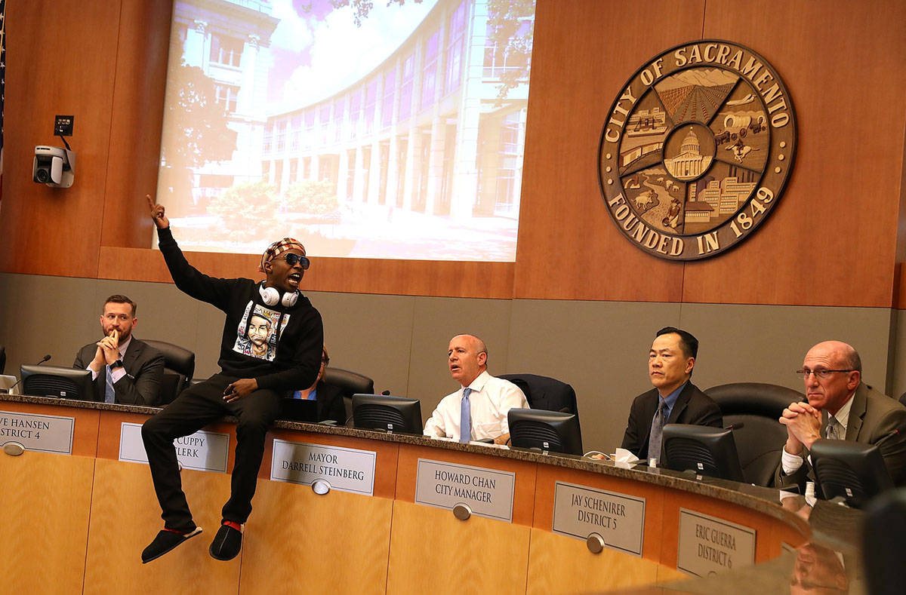

### Photo

Stevante Clark, brother of Stephon Clark, disrupts a special city-council meeting at Sacramento City Hall on March 27, 2018, in Sacramento, California. Hundreds packed a special city-council meeting at Sacramento City Hall to address concerns over the shooting death of Stephon Clark by Sacramento police. (via the Atlantic)

`Justin Sullivan / Getty`

### As You Already Know
Facebook has [lost](http://business.financialpost.com/technology/u-s-ftc-investigating-facebooks-privacy-practices) $70 billion in 10 days — and now advertisers are pulling out.

Canada wants clearer warnings on junk food. The US is using NAFTA to [stop them](https://www.vox.com/2018/3/24/17152144/canada-wants-clearer-warnings-on-junk-food-the-us-is-using-nafta-to-stop-them).

China claims Kim Jong Un has agreed to [denuclearize](https://www.cnbc.com/2018/03/27/north-koreas-kim-jong-un-visits-china-according-to-state-media.html) Korean Peninsula.

Mark Zuckerberg [refused](https://www.independent.co.uk/life-style/gadgets-and-tech/news/facebook-mark-zuckerberg-uk-parliament-data-cambridge-analytica-dcms-damian-collins-a8275501.html) a request from the UK parliament to speak about data abuse.

Canada will likely [legalize](https://hightimes.com/news/canada-legalize-marijuana-summer/) marijuana by the end of the summer.

"A controversial London-based academic with close ties to Nigel Farage has been [detained](https://www.theguardian.com/us-news/2018/mar/30/fbi-questions-ted-malloch-trump-campaign-figure-and-farage-ally) by the FBI upon arrival in the US and issued a subpoena to testify before Robert Mueller, the special counsel who is investigating possible collusion between the Trump campaign and the Kremlin."

Snapchat is [building](https://www.recode.net/2018/3/27/17170552/snapchat-api-data-sharing-facebook) the same kind of data-sharing API that just got Facebook into trouble.

China [banned](http://www.businessinsider.com/china-internet-kim-jong-un-fatty-on-the-train-to-avoid-censors-2018-3?r=UK&IR=T) all mention of Kim Jong Un while he was in Beijing — so people called him 'fatty on the train' instead.

### The Ideas

[The Paradox of Universal Basic Income](https://www.wired.com/story/the-paradox-of-universal-basic-income/) // Liberals and conservatives alike love—and fear—the idea of giving free money to everyone. But we have to try it anyway.

[Mormons’ Weekly Family Ritual Is an Antidote to Fast-Paced Living](https://www.theatlantic.com/family/archive/2018/03/mormon-family-home-evening/556658/) // Family home evening—regular time set aside for praying and playing—has taken on new relevance a century after it was conceived.

[Can Social Media Be Saved?](https://www.nytimes.com/2018/03/28/technology/social-media-privacy.html) // They exploit our data and make us unhappy. They spread misinformation and undermine democracy. Is salvation possible for social networks?

### The Leaks

[`CAMBRIDGE ANALYTICA + FACEBOOK CORRESPONDENCE`](http://www.businessinsider.com/emails-facebook-cambridge-analytica-response-data-scandal-2018-3)

`Business Insider`

[`'MAYBE IT COSTS A LIFE': INTERNAL FACEBOOK MEMO ON GROWTH`](https://www.buzzfeed.com/ryanmac/growth-at-any-cost-top-facebook-executive-defended-data)

`BuzzFeed NEWS`

### The Glitch
[Mozilla's Facebook Container](https://blog.mozilla.org/firefox/facebook-container-extension/) // Mozilla launched the 'Facebook Container' extension for its Firefox browser, isolating the Facebook identity of users from rest of their web activity.

[Uber is Ripping Off Frequent Riders—Here’s How to Avoid It](https://therideshareguy.com/uber-is-ripping-off-frequent-riders-and-heres-how-to-avoid-it/) // Drivers already know upfront pricing typically doesn't work in our favor. But what is upfront pricing, or variations of it, looking like for passengers? We had frequent traveler and RSG contributor Will analyze how Uber charges frequent riders.

[Facebook scraped call, text message data for years from Android phones](https://arstechnica.com/information-technology/2018/03/facebook-scraped-call-text-message-data-for-years-from-android-phones/) // Maybe check your data archive to see if Facebook’s algorithms know who you called.

### The Web
[Mozilla Facebook Container](https://addons.mozilla.org/en-US/firefox/addon/multi-account-containers/) // Here's the actual extension from the article featured just a few lines up.

### The Long Read
https://www.newyorker.com/magazine/2018/04/09/at-uber-a-new-ceo-shifts-gears **At Uber, a New C.E.O. Shifts Gears**: Dara Khosrowshahi is charged with turning the scandal-plagued startup into a traditional company—without sacrificing what made it successful.

### Actionable
https://www.battleforthenet.com/ Net Neutrality died. But we can bring it back. Help save the Internet.
